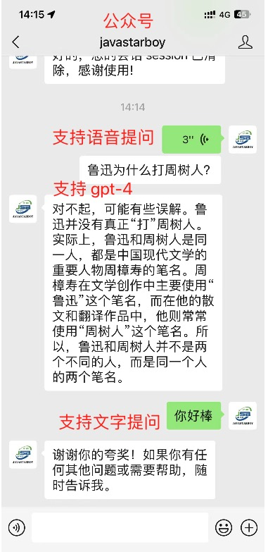
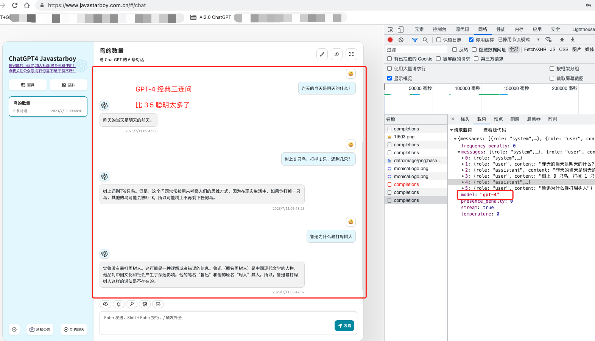

# WeChatGPT_JSB

## 介绍
本项目实现了【微信公众号对接OpenAI】，实现了 ChatGPT 聊天对话功能，仅需要手机与公众号聊天即可，其余的交给代码实现。 没有任何门槛。
- 先给大家看下效果（大家也可以先关注公众号体验一下）
- 支持文本、语音消息向 GPT 提问


- 公众号二维码
<div style="text-align:center">
    
</div>

## 软件架构
- Python 3.9+
- Flask 架构
- Redis 集群
- OpenAI、微信公众平台普通消息接口
- 开启微信语音识别功能，也可不开启，就只纯文本也行

## 安装教程
1.  使用 pip 进行安装模块
    ```
    pip install -r requirements.txt
    ```
2. 运行 
    ```commandline
    python3 WeChatController.py
    或后台启动
    nohup python3 WeChatController.py >/dev/null 2>&1 &
    ```

## 使用说明

#### 【1】settings.py 说明
| key                  | value 含义            | 说明                                             |
|----------------------|---------------------|------------------------------------------------|
| weToken              | 微信公众号的 token        | 需要开通并启用服务器配置（需要域名）                             |
| chat_gpt_key         | openai 的的 api_key   | 不会申请的看我公众号：javastarboy                         |
| txProxyUrl           | 腾讯云服务器函数服务，跳转硅谷区域代理 | 也可使用其他代理方式                                     |
| clearSessionTime     | 会话 session 自动失效时间，秒 | 超过此时间清空会话记录，也可不清空，看自己意愿                        |
| interceptionLength   | 历史对话返回字节长度          | 微信支持的最大字节 2048，大概 600 个汉字左右                    |
| host、port、password 、db | redis 单机配置方式        | 此项目使用的集群模式，工具类 RedisUtil.py 也是集群，如果用单机，改一下代码即可 |
| startup_nodes   | 集群的配置节点             | 工具类 RedisUtil.py                                         |
| sentinel_list          | 哨兵模式的配置节点       | 工具类 RedisUtil.py                                        |


#### 【2】代理服务说明
我用的是腾讯云的函数代理服务，购买的是美国硅谷服务器，所以网络问题自然不存在了。
随时可用，没有门槛，解决了大问题了。
需要教程的关注我微信公众号：javastarboy 即可获取。

#### 【3】微信公众号服务器配置启用说明
`需要详细教程的也可以关注我微信公众号：javastarboy 即可获取。`
- 登录 [微信公众平台](https://mp.weixin.qq.com/)
- 点击左侧菜单【设置与开发】
- 点击菜单【基本配置】
- 下滑配置【服务器配置】
- 填写【服务器地址(URL)】与【令牌(Token)】
- 右侧点击【启用】
  > 注意：如果不启用是没效果的，同时自定义的菜单、自定义回复都将失效

## 功能清单

- [x] 回复消息「功能说明」查看功能清单与使用说明并获取见面礼福利
- [x] 支持文本、语音向 GPT3.5、GPT-4 双模型提问
- [x] 回复消息「查询余额+你的api_key」可以查看你的账户余额情况
- [x] 回复消息「继续」查看 ChatGPT 最近一次回答内容
- [x] 回复消息「历史对话」记录查看
- [x] 回复消息「继续写」让 ChatGPT 输出新的回答
- [x] 回复消息「stop」清空会话记录
- [ ] 客服消息接口对接，延迟消息自动回复给用户，彻底解决手动回复 「继续」获取结果

## 业务对接流程图


## ChatGPT 网页版以及学习手册等福利

- 国内永久免费使用ChatGPT网站
    - https://www.jsbcp.top
    - 密码-群里更新：加微信「javastarboy」拉你进群

- GPT4.0 转发API套餐介绍（可免费试用 3-6 次）
    - https://ydyrb84oyc.feishu.cn/docx/XO3AdeWXZo5l8YxrGEHcLFo6n5p

- 参数设定说明详见如下链接第三章节《模型等参数的使用说明》介绍
    - https://ydyrb84oyc.feishu.cn/docx/Vnt9dJ5FzoBH3IxyRW2cNwmln3b

- 免费学习材料福利导航——目录版
    - https://ydyrb84oyc.feishu.cn/sheets/OfKvsq41MhRF5wt2kafcrR7lnVg

- 免费学习材料福利导航——飞书版
    - https://ydyrb84oyc.feishu.cn/wiki/SOpywcxjUikIS1k1LQZcTj0unJg



# 交流社群

如果你觉得我的分享对比有帮助，也欢迎加入我们交流社群，每天都有很多关于 ChatGPT、人工智能 AI、Python、变现创业的相关分享。
[点我查看社群介绍](https://mp.weixin.qq.com/s/7rEZNtEPSdtwySki_pvPDw)


# 🔥AI2.0实验室 | 交流学习微信群


# 赞助

***
如果你觉得这个项目对你有帮助，并且情况允许的话，可以给我一点点支持，总之非常感谢支持～

## 微信
<div style="text-align:center">
    
</div>

## 支付宝
<div style="text-align:center">
    
</div>
